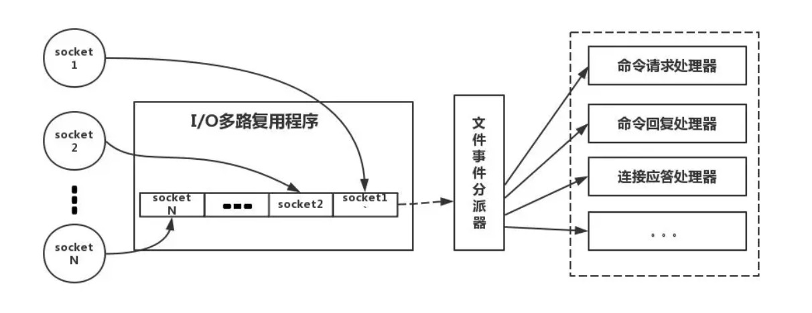

* content
{:toc}

## 简介

* Redis是非关系型数据库, 即NoSql数据库, 存储的数据模型是key-value, 特点是访问速度快

## 为什么使用Redis

* 性能

    我们在碰到需要执行耗时特别久，且结果不频繁变动的SQL，就特别适合将运行结果放入缓存。这样，后面的请求就去缓存中读取，使得请求能够迅速响应。

* 并发

    在大并发的情况下，所有的请求直接访问数据库，数据库会出现连接异常。这个时候，就需要使用redis做一个缓冲操作，让请求先访问到redis，而不是直接访问数据库。

## Redis的缺点

* 缓存和数据库双写一致性问题

* 缓存雪崩问题

* 缓存击穿问题

* 缓存的并发竞争问题

## 单线程Redis为什么这么快?

* 纯内存操作

* 单线程操作，避免了频繁的上下文切换

* 采用了非阻塞I/O多路复用机制

    我们现在要仔细的说一说I/O多路复用机制，因为这个说法实在是太通俗了，通俗到一般人都不懂是什么意思。博主打一个比方：小曲在S城开了一家快递店，负责同城快送服务。小曲因为资金限制，雇佣了一批快递员，然后小曲发现资金不够了，只够买一辆车送快递。

    * 经营方式一

        客户每送来一份快递，小曲就让一个快递员盯着，然后快递员开车去送快递。慢慢的小曲就发现了这种经营方式存在下述问题
        
        几十个快递员基本上时间都花在了抢车上了，大部分快递员都处在闲置状态，谁抢到了车，谁就能去送快递
        
        随着快递的增多，快递员也越来越多，小曲发现快递店里越来越挤，没办法雇佣新的快递员了
        
        快递员之间的协调很花时间
        
        综合上述缺点，小曲痛定思痛，提出了下面的经营方式
        
    * 经营方式二

        小曲只雇佣一个快递员。然后呢，客户送来的快递，小曲按送达地点标注好，然后依次放在一个地方。最后，那个快递员依次的去取快递，一次拿一个，然后开着车去送快递，送好了就回来拿下一个快递。

        对比上述两种经营方式对比，是不是明显觉得第二种，效率更高，更好呢。在上述比喻中:

    每个快递员------------------>每个线程

    每个快递-------------------->每个socket(I/O流)
    
    快递的送达地点-------------->socket的不同状态
    
    客户送快递请求-------------->来自客户端的请求
    
    小曲的经营方式-------------->服务端运行的代码
    
    一辆车---------------------->CPU的核数

1.     于是我们有如下结论:
    
    * 经营方式一就是传统的并发模型，每个I/O流(快递)都有一个新的线程(快递员)管理。

    * 经营方式二就是I/O多路复用。只有单个线程(一个快递员)，通过跟踪每个I/O流的状态(每个快递的送达地点)，来管理多个I/O流。

    下面类比到真实的redis线程模型，如图所示

     

## 数据结构

* String类型, value只能是String类型

    这个其实没啥好说的，最常规的set/get操作，value可以是String也可以是数字。一般做一些**复杂的计数功能的缓存**。

* Hash类型, 可以对key进行分类

    这里value存放的是结构化的对象，比较方便的就是操作其中的某个字段。在做**单点登录**的时候，就是用这种数据结构存储用户信息，以cookieId作为key，设置30分钟为缓存过期时间，能很好的模拟出类似session的效果。

* List类型, 所有元素是有序的

    使用List的数据结构，可以做**简单的消息队列的功能**。另外还有一个就是，可以利用lrange命令，做**基于redis的分页功能**，性能极佳，用户体验好。

* Set类型, 元素是无序的, 元素不能重复. 并集, 交集, 差集

    因为set堆放的是一堆不重复值的集合。所以可以做**全局去重**的功能。为什么不用JVM自带的Set进行去重？因为我们的系统一般都是集群部署，使用JVM自带的Set，比较麻烦，难道为了一个做一个全局去重，再起一个公共服务，太麻烦了。
另外，就是利用交集、并集、差集等操作，可以计算**共同喜好，全部的喜好，自己独有的喜好等功能**
    
* SortedSet, 有序的set, 元素不能重复且有序

    sorted set多了一个权重参数score,集合中的元素能够按score进行排列。可以做**排行榜应用，取TOP N操作**。可以用来做**延时任务**。最后一个应用就是可以做**范围查找**。  
    
        private String ss = "10";
    
## 参考

[https://mp.weixin.qq.com/s/gEU8HtsQNPXY8bzkK-Qllg][1]

[1]: https://mp.weixin.qq.com/s/gEU8HtsQNPXY8bzkK-Qllg
    
    
    
    