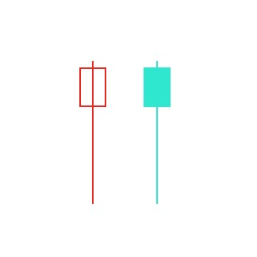
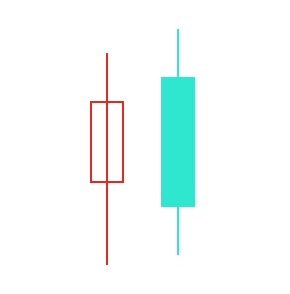
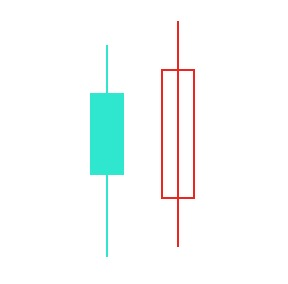

## 锤子线和上吊线

在上涨中出现叫做"上吊线"预示顶部反转, 在下跌中出现叫做"锤子线"预示底部反转, 无关颜色

三个关键点:

1. 实体处于整个价格区间的上端, 而实体本身的颜色是无所谓的

1. 下影线的长度至少达到实体高度的2倍

1. 在这类蜡烛线中, 应当没有上影线, 即使有上影响其长度也是极短的

**下影线越长, 上影线越短, 实体越小, 这类蜡烛图越有意义**

**如果看涨的锤子线是红色的, 则看涨的意义更坚挺几分, 反之看跌的上吊线是蓝色的, 看跌的意义更疲软一些**

**锤子线的前一日发生了较大的下跌, 就需要进行佐证, 次日的收市价高于锤子线的收市价并且颜色是红色, 佐证锤子线**

**上吊线次日的开市价低于上吊线的实体, 收市价低于上吊线的收市价并且是蓝色实体, 佐证上吊线**

**两者共同的条件是出现之前都有一段上涨或下跌的趋势**

## 吞没形态(抱线形态)

由两根颜色相反的蜡烛线实体构成, 有颜色区分

下图在上升趋势中出现, 预示顶部反转

下图在下降趋势中出现, 预示底部反转

三个关键点:

1. 在吞没形态之前, 市场必须处在清晰可辨的上升趋势或下降趋势中, **哪怕这个趋势只是短期的**

1. 吞没形态必须由2条蜡烛线组成, 其中第二条蜡烛线的实体必须覆盖第一根蜡烛线的实体(但不一定吞没前者的上下影线)

1. 吞没形态的第二个实体必须与第一个实体的颜色相反, 这一条标准有例外的情况, 第一条蜡烛线的实体必须非常小, 小的几乎构成了一根十字线(或者就是一根十字线), 如此一来, 如果在长期的下降趋势之后, 一个小小的白色实体被一个巨大的白色实体吞没, 那么就构成了底部反转, 反之在上升趋势中, 一个小小的蓝色实体被一个大大的蓝色实体吞没, 那么也构成了顶部反转

